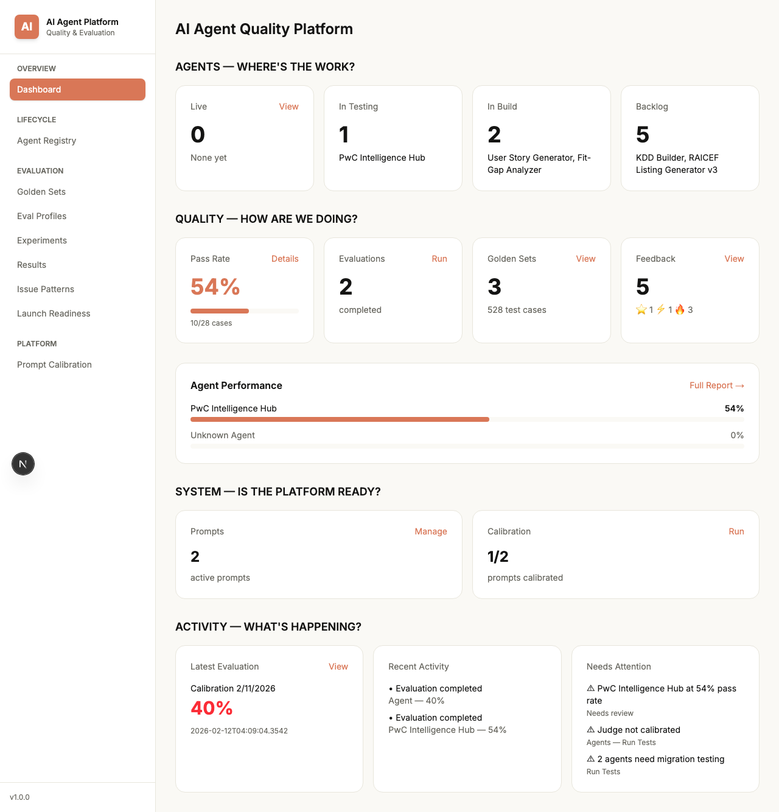
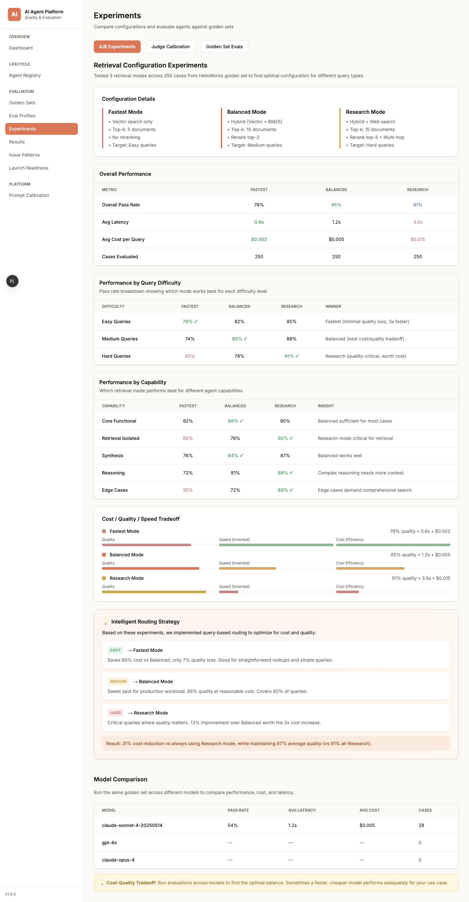
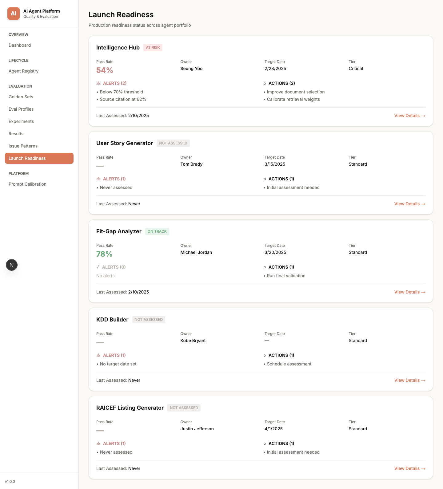

# AI Agent Evaluation Platform

> Systematic evaluation, experiment tracking, and performance optimization for AI agents

---

## Overview

Modern AI teams building LLM applications face a core infrastructure challenge: **how do you systematically measure agent behavior, compare configurations, and optimize for production?**

This platform provides the evaluation infrastructure to answer those questions through:
- Controlled experimentation across agent configurations
- Multi-dimensional performance measurement
- Calibrated automation for scaled evaluation
- Production readiness decision support

**Built for:** ML/AI teams developing production LLM applications who need to compare configurations, measure performance across test sets, optimize agent behavior, and make evidence-based deployment decisions.

*Note: Performance data shown is illustrative for demonstration purposes.*

---

**Key Features:**
- Experiment run as core abstraction (versioned configs, structured artifacts, reproducibility)
- Configuration A/B testing with multi-dimensional performance analysis
- Calibrated LLM-as-judge scoring aligned to human evaluation
- Dimensional failure slicing via test taxonomy (difficulty × capability × domain)
- Threshold-based production gating with blocking conditions

---

## Screenshots

### Dashboard


### Experiments


### Launch Readiness


---

## Core Abstraction

The core abstraction is the **experiment run**: a versioned test set evaluated against a specific agent configuration, producing structured metrics, failure artifacts, and regression comparisons.

This enables reproducible evaluation, systematic tradeoff analysis, and confidence-backed release decisions.

---

## Key Capabilities

### 1. **Experiment Tracking** (Experiments)

Controlled comparison of configurations through evaluation runs.

**A/B Experiments:**
- Configuration comparison across different agent modes
- Performance breakdown by query difficulty and agent capability
- Cost/quality/speed tradeoff analysis
- Optimization insights for intelligent routing

**Judge Calibration:**
- LLM-as-judge alignment to human evaluation
- Agreement metrics across scoring dimensions
- Prompt iteration and accuracy tracking

**Model Comparison:**
- Side-by-side performance across LLM providers
- Latency and cost benchmarking

---

### 2. **Systematic Evaluation** (Golden Sets + Results)

Curated test sets with dimensional performance analysis.

**Golden Sets:**
- 528 test cases with multi-dimensional taxonomy
- Coverage tracking across test types, capabilities, difficulty, domains
- Import/export workflows for collaboration

**Results Dashboard:**
- Dimensional failure analysis (Answer Correctness, Sources, Response Quality)
- Granular issue breakdown (missing-info, wrong-docs, too-verbose, etc.)
- Performance slicing by difficulty, capability, domain
- Pass rate trends over time

---

### 3. **Production Readiness** (Launch Readiness)

Threshold-based release gating with blocking conditions and decision artifacts.

**Agent Portfolio View:**
- Performance status and quality thresholds per agent
- Blocking conditions and alert system
- Owner tracking and target timelines
- Release decision documentation

---

### 4. **Portfolio Observability** (Dashboard)

Aggregate visibility across the agent development lifecycle.

**Lifecycle Tracking:**
- Agent status across stages (Backlog → Build → Testing → Live)
- Quality metrics aggregated portfolio-wide
- System readiness indicators
- Recent activity feed

---

### 5. **Evaluation Automation** (Prompt Calibration)

Reduces manual review load through calibrated LLM scoring.

**3-Question Framework:**
- Simplified scoring (Answer/Sources/Response quality)
- Issue tag taxonomy for granular analysis
- Prompt registry and versioning

**Calibration Workflow:**
- Human-LLM agreement measurement
- Threshold-based automation trust
- Iteration tracking for prompt improvement

---

## Key Design Decisions

### 1. **3-Question Evaluation Framework**

Simplified from complex rubrics to three yes/partial/no questions:
- **Is the answer correct?** (Yes/Partially/No)
- **Are the sources correct?** (Yes/Partially/No)  
- **Is the response appropriate?** (Good/Average/Not Good)

Each dimension includes granular issue tags for detailed failure analysis.

**Why this works:**
- Reduces cognitive load for human evaluators
- Maintains analytical depth through issue tags
- Supports LLM-as-judge calibration workflows
- Balances simplicity with actionable insights

**Implementation:**
- Human evaluators answer three simple questions
- Issue tags applied only when answer isn't "Yes"
- LLM judges calibrated to approximate human scoring patterns
- Disagreements flagged for human review

---

### 2. **Configuration Experiments**

Tested 3 agent configurations across 250 test cases to find optimal settings for different query types.

**Configurations:**
- **Fastest Mode:** Optimized for low latency and cost
- **Balanced Mode:** Moderate speed/cost/quality tradeoff
- **Research Mode:** Optimized for quality over speed/cost

**Analysis Dimensions:**
- Query difficulty (Easy/Medium/Hard)
- Agent capability (Core Functional/Retrieval/Synthesis/Reasoning/Edge Cases)
- Performance metrics (pass rate, latency, cost)

**Key Findings:**

| Configuration | Overall | Easy | Medium | Hard | Latency | Cost |
|--------------|---------|------|--------|------|---------|------|
| Fastest | 78% | 78% ✓ | 74% | 65% | 0.6s ⚡ | $0.002 💰 |
| Balanced | 85% | 82% | 85% ✓ | 78% | 1.2s | $0.005 |
| Research | 91% | 85% | 89% | 91% ✓ | 3.5s | $0.015 |

**Optimization Strategy:**
Intelligent routing by query difficulty:
- Easy queries → Fastest mode (minimal quality loss, 3x faster)
- Medium queries → Balanced mode (best cost/quality tradeoff)
- Hard queries → Research mode (13% improvement worth 3x cost)

**Impact:** 31% cost reduction vs always-Research while maintaining 87% average quality (vs 91% all-Research).

**Insight:** Configuration isn't one-size-fits-all. Different query types benefit from different performance profiles.

---

### 3. **Dimensional Test Taxonomy**

Test cases tagged across multiple dimensions for granular performance analysis.

**Taxonomy:**
- **Test Type:** Core Functional, Retrieval Isolated, Generation Isolated, Boundary & Edge, Adversarial & Safety, Regression Anchor
- **Capability:** Retrieval, Synthesis, Reasoning, Extraction, Clarification
- **Difficulty:** Easy, Medium, Hard
- **Domain:** BRD, FSD, SOW, Governance, Test Artifacts, Meeting/Comms

**Enables slicing results to understand which configurations work best for what types of queries.**

**Example Insights:**
- Research mode critical for Retrieval-Isolated tasks (92% vs 68% Fastest)
- Balanced mode sufficient for Core Functional (88% vs 90% Research - not worth 3x cost)
- Edge Cases demand Research configuration regardless of difficulty (88% Research vs 55% Fastest)

**Coverage Dashboard:**
Visual tracking of test distribution across dimensions to identify gaps.

---

### 4. **Production Readiness Framework**

Threshold-based release gating with structured decision artifacts.

**Components:**
- Quality thresholds per agent
- Blocking conditions with severity levels
- Decision documentation and approval workflow
- Risk assessment tracking

**Example Decision Artifact:**
"Intelligence Hub at 54% pass rate - below 70% threshold. Blocking: Source citation accuracy (62%). Recommended action: Focus on improving document selection. Target resolution: 2/28."

---

## Experiment Workflow Example

**Scenario:** Optimize agent configuration for the Intelligence Hub

**1. Hypothesis**
Different query types may benefit from different performance profiles. Easy queries might not need expensive Research mode.

**2. Experiment Design**
- Configurations: Fastest, Balanced, Research
- Test set: 250 cases from HelloWorks golden set
- Analysis: Slice by difficulty and capability

**3. Execution**
- Run all 3 configs against same test set
- Measure pass rate, latency, cost per query
- Tag failures with issue types

**4. Analysis**
Performance by difficulty:
- Easy: Fastest 78%, Balanced 82%, Research 85%
- Medium: Fastest 74%, Balanced 85%, Research 89%
- Hard: Fastest 65%, Balanced 78%, Research 91%

Performance by capability:
- Retrieval-Isolated: Fastest 68%, Balanced 79%, Research 92%
- Core Functional: Fastest 82%, Balanced 88%, Research 90%

**5. Insight**
Research mode provides diminishing returns for Easy queries (7% improvement) but critical gains for Hard queries (26% improvement) and Retrieval-Isolated tasks (24% improvement).

**6. Optimization Decision**
Implement intelligent routing:
- Classify query difficulty at runtime
- Route Easy → Fastest, Medium → Balanced, Hard → Research
- Expected: 87% quality at 31% lower cost

**7. Validation**
Run routing strategy against holdout set to confirm cost/quality projections.

---

## Technical Stack

- **Next.js 16** - React framework with App Router
- **TypeScript** - Type safety
- **Tailwind CSS v4** - Styling
- **React Hooks** - State management

---

## Running Locally
```bash
# Install dependencies
npm install

# Run development server
npm run dev

# Open http://localhost:3000
```

---

## Platform Modules

### Dashboard
Agent lifecycle stages, quality metrics, system status, activity feed

### Experiments
- A/B Experiments: Configuration comparison, performance analysis
- Judge Calibration: LLM-human alignment measurement
- Golden Set Evals: Test execution history, regression tracking

### Launch Readiness
Agent portfolio cards, quality thresholds, blocking conditions, release gating

### Results
Top failure drivers, issue tag breakdown, performance by difficulty/capability/domain, trends

### Golden Sets
Test case management, coverage dashboard, dimensional taxonomy, import/export

### Prompt Calibration
Judge prompt registry, calibration status, accuracy tracking, configuration

---

## Design Philosophy

**Controlled experiments over trial-and-error**
**Multi-dimensional analysis beyond aggregates**
**Calibrated automation to reduce manual review**
**Evidence-based decision support**

---

## Future Directions

- Real-time evaluation execution engine
- Integration with vector databases and LLM APIs
- Statistical significance testing for experiments
- Automated regression detection and alerting
- Collaborative review workflows
- Trace-level debugging
- Cost tracking and budget management
- Prompt optimization suggestions

---

## About

This platform enables systematic evaluation and optimization of AI agents. The frameworks and analysis approaches reflect production requirements: comparing configurations, measuring behavior across test sets, optimizing for cost and quality, and making evidence-based deployment decisions.

---

## Contact

Questions or feedback? Open an issue.

**Repository:** [github.com/seunghyoo125/ai-agent-quality-platform](https://github.com/seunghyoo125/ai-agent-quality-platform)